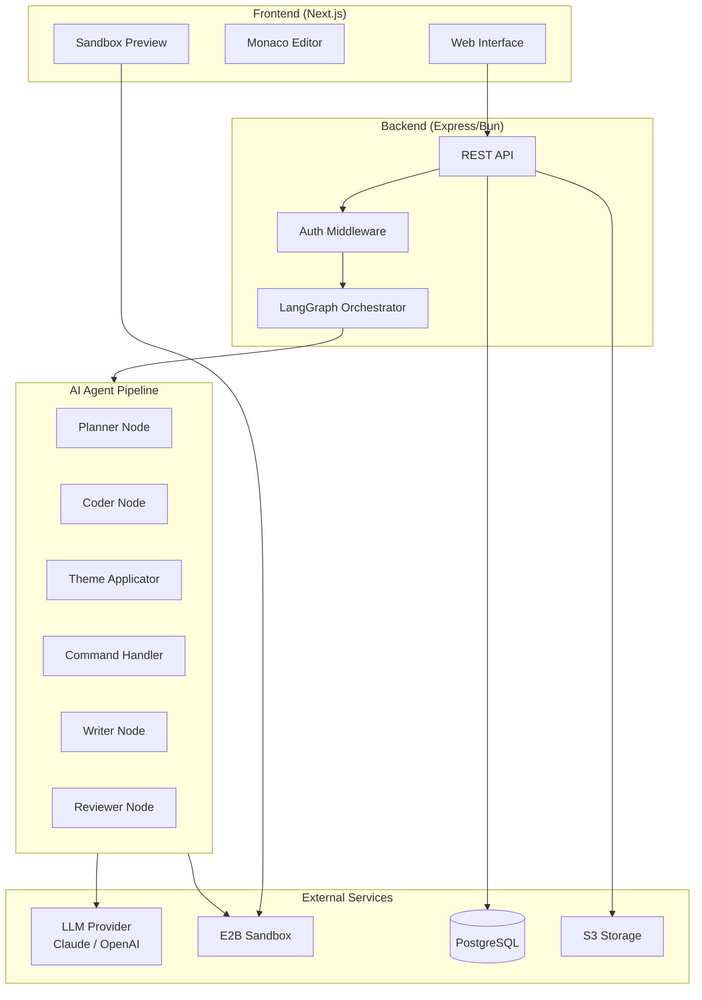
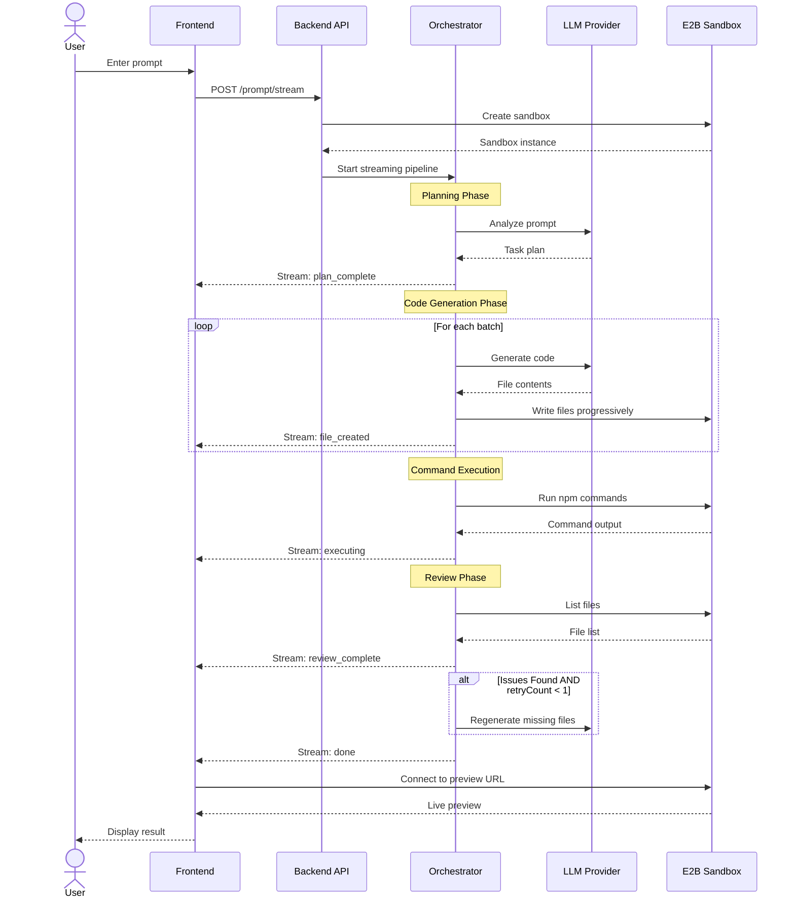

# Appwit

An AI-powered code generation platform built as a Turborepo monorepo. Users describe what they want to build, and the system generates production-ready code files in an isolated sandbox environment.

## Table of Contents

- [Overview](#overview)
- [Architecture](#architecture)
- [Tech Stack](#tech-stack)
- [Project Structure](#project-structure)
- [Getting Started](#getting-started)
- [Development](#development)
- [API Reference](#api-reference)
- [License](#license)

---

## Overview

Appwit enables users to generate complete web applications from natural language prompts. The platform leverages:

- **LangGraph State Machine** for orchestrating multi-step AI workflows
- **E2B Sandboxes** for secure, isolated code execution and file management
- **LLM Integration** supporting Anthropic Claude and OpenAI models
- **Real-time Streaming** for progressive file generation feedback

---

## Architecture

### System Architecture



### UML Sequence Diagram: Code Generation Flow



---
## Project Structure

```
appwit/
├── apps/
│   ├── backend/                 # Express API server
│   │   ├── agent/               # LangGraph orchestrator
│   │   │   ├── nodes/           # Pipeline nodes
│   │   │   │   ├── planner.ts   # Task planning
│   │   │   │   ├── coder.ts     # Code generation
│   │   │   │   ├── writer.ts    # File writing
│   │   │   │   └── reviewer.ts  # Validation
│   │   │   ├── orchestrator.ts  # State machine
│   │   │   └── systemPrompts/   # LLM prompts
│   │   ├── routes/              # API endpoints
│   │   ├── middleware/          # Auth middleware
│   │   ├── prisma/              # Database schema
│   │   └── lib/                 # Utilities
│   └── frontend/                # Next.js application
│       ├── app/                 # App router pages
│       ├── components/          # React components
│       ├── hooks/               # Custom hooks
│       └── lib/                 # Utilities
├── docker/                      # Docker configurations
├── ops/                         # Deployment configs
├── turbo.json                   # Turborepo config
└── package.json                 # Root workspace
```

---

## Getting Started

### Prerequisites

- [Bun](https://bun.sh/) v1.1.38 or higher
- PostgreSQL database
- E2B API key
- LLM provider API key (Anthropic or OpenAI)

### Installation

1. Clone the repository:

```bash
git clone https://github.com/your-org/appwit.git
cd appwit
```

2. Install dependencies:

```bash
bun install
```

3. Configure environment variables:

```bash
cp .env.example .env
cp apps/backend/.env.example apps/backend/.env
cp apps/frontend/.env.example apps/frontend/.env
```

4. Set up the database:

```bash
cd apps/backend
bunx prisma generate
bunx prisma db push
```

5. Start development servers:

```bash
bun run dev
```

---

## Development

### Commands

| Command | Description |
|---------|-------------|
| `bun run dev` | Start all apps in development mode |
| `bun run build` | Build all apps for production |
| `bun run lint` | Run linting across all workspaces |
| `bun run clean` | Remove build artifacts |
| `bun run format` | Format code with Prettier |

### Run Specific Workspace

```bash
# Backend only
bun run dev --filter=@appwit/backend

# Frontend only
bun run dev --filter=@appwit/frontend
```

### Turborepo Features

- **Build Caching**: Caches build outputs to speed up subsequent builds
- **Task Orchestration**: Runs tasks in the correct order based on dependencies
- **Parallel Execution**: Runs independent tasks in parallel

---

## API Reference

### Authentication

| Endpoint | Method | Description |
|----------|--------|-------------|
| `/auth/signup` | POST | Register new user |
| `/auth/signin` | POST | Login with credentials |
| `/auth/google` | POST | Google OAuth login |

### Projects

| Endpoint | Method | Description |
|----------|--------|-------------|
| `/project` | GET | List user projects |
| `/project` | POST | Create project |
| `/project/:id` | GET | Get project details |
| `/project/:id` | DELETE | Delete project |

### Code Generation

| Endpoint | Method | Description |
|----------|--------|-------------|
| `/prompt/stream` | POST | Stream code generation |
| `/prompt/files/:sandboxId` | GET | List sandbox files |
| `/prompt/file/:sandboxId` | GET | Read file content |

### Health Check

| Endpoint | Method | Description |
|----------|--------|-------------|
| `/health` | GET | Service health status |

---

## Environment Variables

### Backend

| Variable | Description |
|----------|-------------|
| `PORT` | Server port |
| `DATABASE_URL` | PostgreSQL connection string |
| `JWT_SECRET` | JWT signing secret |
| `E2B_API_KEY` | E2B sandbox API key |
| `ANTHROPIC_API_KEY` | Anthropic API key |
| `OPENAI_API_KEY` | OpenAI API key |
| `AWS_ACCESS_KEY_ID` | AWS credentials |
| `AWS_SECRET_ACCESS_KEY` | AWS credentials |
| `AWS_S3_BUCKET` | S3 bucket name |

### Frontend

| Variable | Description |
|----------|-------------|
| `NEXT_PUBLIC_API_URL` | Backend API URL |

---

## License

This project is private and proprietary.
